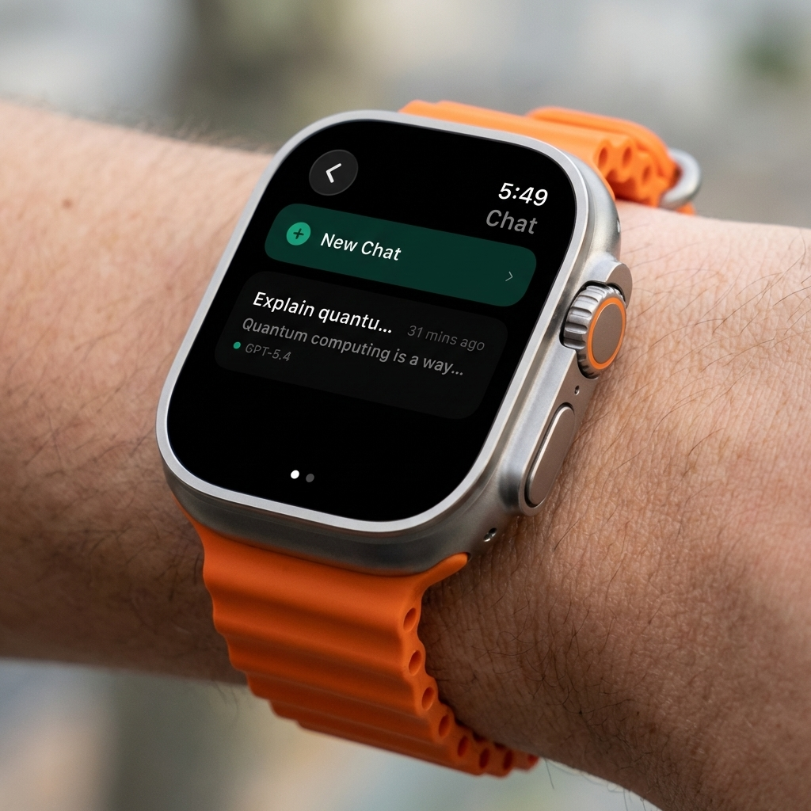

<p align="center">
  
</p>

<h1 align="center">ChatGPT Watch</h1>

<p align="center">
  <strong>ChatGPT on your wrist. For real.</strong>
</p>

<p align="center">
  A native watchOS client for ChatGPT with streaming chat, live voice conversations,<br>
  Codex coding tasks, and OpenAI text-to-speech — all from your Apple Watch.
</p>

<p align="center">
  
  
  
  
</p>

---

## Features

### Chat
- **Streaming responses** from GPT-5.4, GPT-5.3, GPT-4o, o3, o4-mini, and 14 more models
- Full conversation history persisted with SwiftData
- Quick prompt suggestions
- Message timestamps, model indicators

### Live Voice Mode
- **Tap mic → speak → hear the answer** — no typing needed
- Records audio on-device via AVAudioRecorder
- Transcribes with OpenAI Whisper API
- Sends to ChatGPT, speaks response with OpenAI TTS
- Full conversation loop: Record → Transcribe → Think → Speak → Repeat
- Animated waveform and phase indicators

### Voice Output (TTS)
- Every assistant message has a **speaker button** — tap to hear it read aloud
- Uses OpenAI TTS API (`tts-1` model, `alloy` voice)
- Falls back to system `AVSpeechSynthesizer` if API is unavailable
- **Auto-speak** — responses are read aloud automatically when streaming finishes
- "Stop speaking" bar to cancel playback

### Codex
- Run coding tasks on your Mac remotely from your wrist
- 8 project directories pre-configured
- Real-time task status tracking (queued → running → completed/failed)
- View code output, file changes, and diffs
- Relay health indicator with setup instructions
- Powered by Node.js relay server + Cloudflare Tunnel

### Design
- Built for **watchOS 26** with Apple's design language
- Original ChatGPT logo throughout
- Dark theme with green (Chat) and purple (Codex) accents
- Horizontal swipe: Home ← → Settings
- Smooth animations and haptic feedback

---

## Architecture

```
ChatGPTWatch/
├── WatchApp/
│   ├── App/           ContentView (Home + Settings), AppState
│   ├── Views/         Chat, Codex, Settings, Voice screens
│   ├── Components/    MessageBubble, TypingIndicator, StatusBadge
│   ├── ViewModels/    ChatViewModel, CodexViewModel, SettingsViewModel
│   ├── Services/      OpenAIService, WhisperService, TTSService, CodexService
│   ├── Models/        ChatModels, CodexModels, SwiftDataModels
│   └── Utilities/     DesignTokens, Extensions, Constants
├── CompanionApp/      iPhone companion for API key setup
├── Widgets/           Circular, Rectangular, Inline watch widgets
├── codex-relay/       Node.js relay server for Codex CLI
└── Shared/            KeychainService, SharedModels
```

## Getting Started

### Prerequisites
- Xcode 26+
- Apple Watch with watchOS 26+ (Series 6 or later)
- OpenAI API key ([get one here](https://platform.openai.com/api-keys))

### Quick Start

```bash
git clone https://github.com/techygarry/ChatGPTWatch.git
cd ChatGPTWatch
open ChatGPTWatch.xcodeproj
```

Add your API key in `WatchApp/Services/AuthService.swift`:
```swift
private static let embeddedKey = "sk-proj-your-key-here"
```

Select your Apple Watch, hit **Run**.

### Codex Relay (Optional)

```bash
cd codex-relay && npm install && node server.js
cloudflared tunnel --url http://localhost:4819
```

Update the tunnel URL in `WatchApp/Services/CodexService.swift`.

## Tech Stack

| | |
|---|---|
| **UI** | SwiftUI, watchOS 26 |
| **State** | `@Observable`, SwiftData |
| **Chat** | OpenAI Chat Completions API, SSE streaming |
| **Voice In** | AVAudioRecorder + OpenAI Whisper API |
| **Voice Out** | OpenAI TTS API + AVSpeechSynthesizer fallback |
| **Storage** | Keychain, SwiftData, UserDefaults |
| **Codex** | Node.js relay + Codex CLI + Cloudflare Tunnel |

## Models

**Chat:** GPT-5.4, GPT-5.3, GPT-5.2, GPT-5.1, GPT-5, GPT-4o, GPT-4o Mini, o3, o3 Mini, o4-mini, GPT-4.1, GPT-4.1 Mini, GPT-4.1 Nano, GPT-4.5

**Codex:** GPT-5.3 Codex, GPT-5.2 Codex, GPT-5.1 Codex, GPT-5.1 Codex Max, GPT-5.1 Codex Mini, GPT-5 Codex

## Contributing

PRs welcome. For major changes, open an issue first.

## License

[MIT](LICENSE)

---

<p align="center">
  <sub>Built by <a href="https://github.com/techygarry">@techygarry</a> with <a href="https://claude.ai/claude-code">Claude Code</a></sub>
</p>
