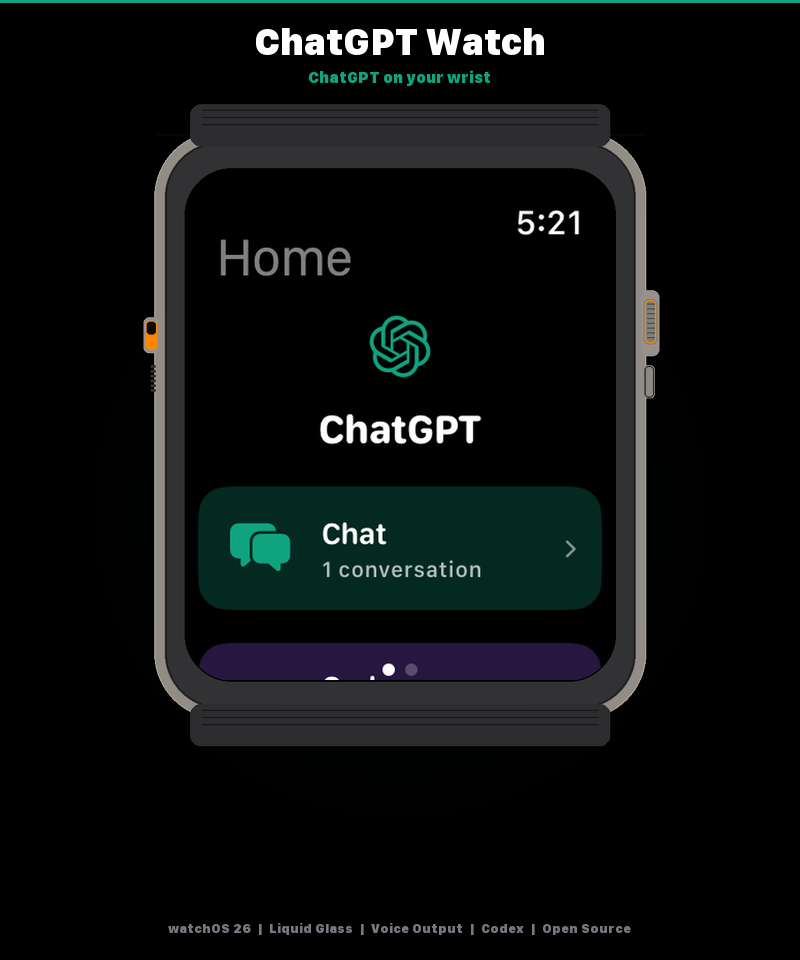
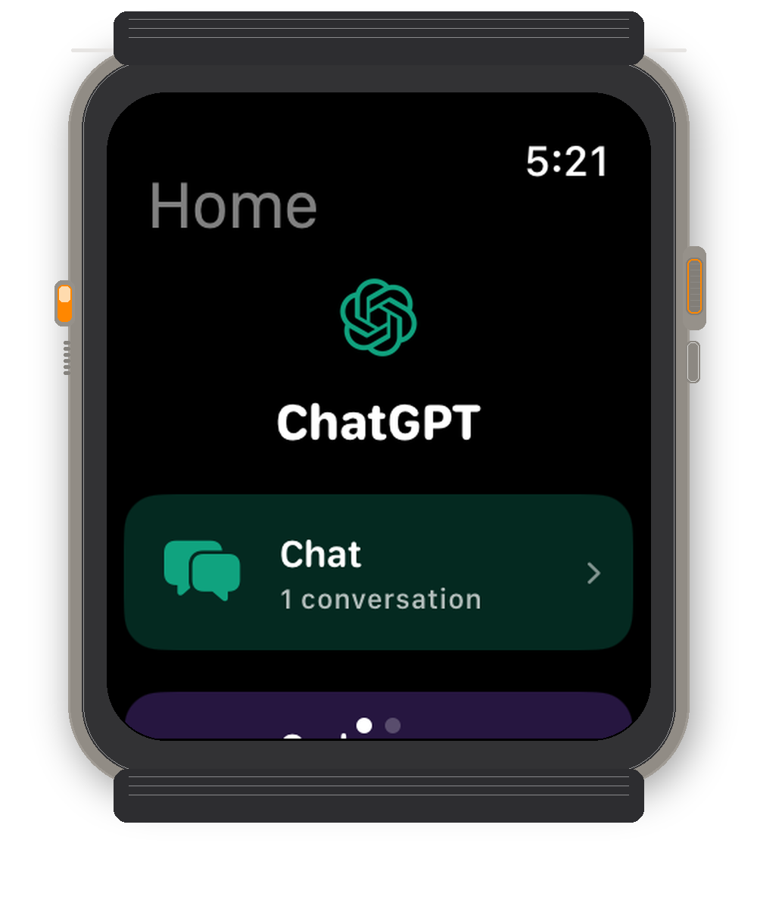

<p align="center">
  
</p>

<h1 align="center">ChatGPT Watch</h1>
<p align="center">
  <strong>ChatGPT on your wrist.</strong><br>
  A full-featured ChatGPT client for Apple Watch, built with SwiftUI and Apple's Liquid Glass design.
</p>

<p align="center">
  
  
  
  
</p>

---

## What is this?

ChatGPT Watch brings the full power of OpenAI's GPT models to your Apple Watch. Chat with GPT-5.x, run Codex coding tasks from your wrist, listen to AI responses with voice output, and manage everything without pulling out your phone.

Built natively for watchOS 26 with Apple's new Liquid Glass design language.

<p align="center">
  
</p>

## Features

**Chat**
- Streaming responses from GPT-5.x models (GPT-5.4, 5.3, 5.2, 5.1, 5, 4o, 4o-mini, o3, o4-mini)
- Full conversation history with SwiftData persistence
- Voice input via watchOS dictation
- Voice output (TTS) - tap the speaker icon on any response to hear it read aloud using OpenAI's text-to-speech API
- Quick prompt suggestions for instant conversations

**Codex**
- Run coding tasks on your Mac remotely from your watch
- Choose from 8 project directories
- Track task status (queued, running, completed, failed)
- View code output and file changes
- Powered by a lightweight Node.js relay server + Cloudflare Tunnel

**Design**
- Apple Liquid Glass UI (watchOS 26)
- ChatGPT logo throughout (the real OpenAI flower icon)
- Dark theme with green (Chat) and purple (Codex) accent colors
- Smooth animations and haptic feedback
- Horizontal swipe between Home and Settings

**More**
- iPhone companion app for easy API key setup
- watchOS widgets (circular, rectangular, inline)
- Keychain-secured API key storage
- Offline-capable with cached conversations

## Architecture

```
ChatGPTWatch/
  WatchApp/
    App/           - ContentView (Home + Settings pages), AppState
    Views/         - Chat, Codex, Settings, Voice, Auth screens
    Components/    - MessageBubble, TypingIndicator, StatusBadge, CodexTaskCard
    ViewModels/    - ChatViewModel, CodexViewModel, SettingsViewModel
    Services/      - OpenAIService, CodexService, TTSService, AuthService
    Models/        - ChatModels, CodexModels, SwiftDataModels
    Utilities/     - DesignTokens, Extensions, Constants, HapticManager
  CompanionApp/    - iPhone companion for API key transfer
  Widgets/         - Circular, Rectangular, Inline watch widgets
  codex-relay/     - Node.js relay server for Codex CLI
  Shared/          - KeychainService, SharedModels
```

## Getting Started

### Prerequisites

- Xcode 26+
- watchOS 26+ (Apple Watch Series 6 or later)
- OpenAI API key (Plus or Pro subscription)
- Node.js 18+ (for Codex relay, optional)

### Setup

1. **Clone the repo**
   ```bash
   git clone https://github.com/techygarry/ChatGPTWatch.git
   cd ChatGPTWatch
   ```

2. **Add your API key**

   Open `WatchApp/Services/AuthService.swift` and set your key:
   ```swift
   private static let embeddedKey = "sk-proj-your-key-here"
   ```
   Or enter it in Settings on the watch after installing.

3. **Build and run**
   ```bash
   open ChatGPTWatch.xcodeproj
   ```
   Select the `ChatGPTWatch` scheme, pick your watch or simulator, and run.

### Codex Relay (Optional)

To run coding tasks from your watch:

1. **Start the relay server**
   ```bash
   cd codex-relay
   npm install
   node server.js
   ```

2. **Expose with Cloudflare Tunnel**
   ```bash
   cloudflared tunnel --url http://localhost:4819
   ```

3. **Update the relay URL** in `WatchApp/Services/CodexService.swift`

## Tech Stack

| Layer | Technology |
|-------|-----------|
| UI | SwiftUI, Liquid Glass, watchOS 26 |
| State | `@Observable`, SwiftData |
| Network | URLSession, SSE streaming |
| Storage | Keychain, SwiftData, UserDefaults |
| TTS | OpenAI TTS API (`tts-1`, `alloy` voice) |
| Codex | Node.js relay + Codex CLI |
| Tunnel | Cloudflare Quick Tunnels |

## Models Supported

### Chat
GPT-5.4, GPT-5.3, GPT-5.2, GPT-5.1, GPT-5, GPT-4o, GPT-4o Mini, o3, o3 Mini, o4-mini, GPT-4.1, GPT-4.1 Mini, GPT-4.1 Nano, GPT-4.5

### Codex
GPT-5.3 Codex, GPT-5.2 Codex, GPT-5.1 Codex, GPT-5.1 Codex Max, GPT-5.1 Codex Mini, GPT-5 Codex

## Contributing

Pull requests welcome. For major changes, open an issue first.

1. Fork the repo
2. Create your feature branch (`git checkout -b feature/amazing-feature`)
3. Commit your changes (`git commit -m 'Add amazing feature'`)
4. Push to the branch (`git push origin feature/amazing-feature`)
5. Open a Pull Request

## License

MIT License. See [LICENSE](LICENSE) for details.

## Acknowledgments

- Built with [Claude Code](https://claude.ai/claude-code) by Anthropic
- Uses the [OpenAI API](https://platform.openai.com)
- Designed for Apple Watch Ultra

---

<p align="center">
  <sub>Made with care by <a href="https://github.com/techygarry">@techygarry</a></sub>
</p>
